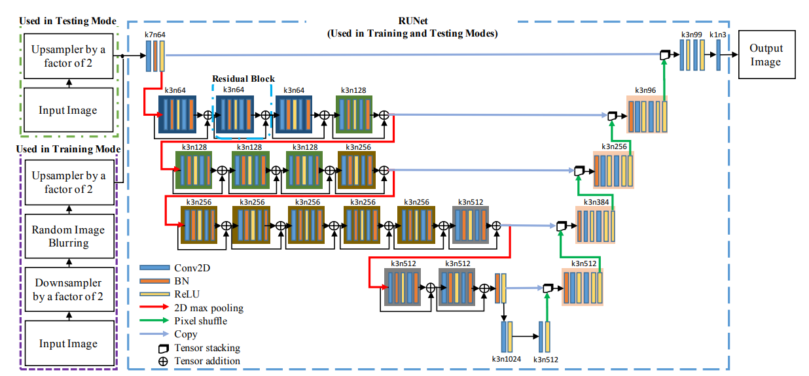
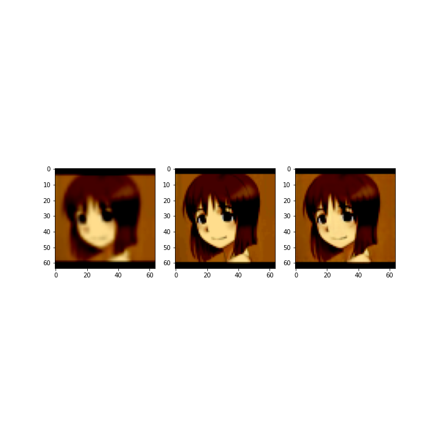
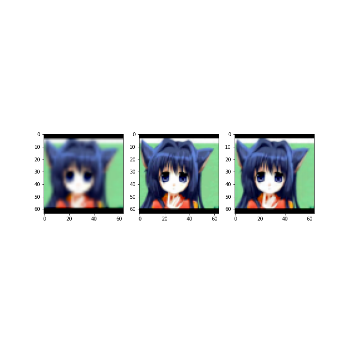

# Runet-Waifu-edition
Runet implementation in pytorch for Waifu Super-resolution
# Model architecture 

## Examples 
Intput/True/Predictions 

## original paper 
https://openaccess.thecvf.com/content_CVPRW_2019/papers/WiCV/Hu_RUNet_A_Robust_UNet_Architecture_for_Image_Super-Resolution_CVPRW_2019_paper.pdf
